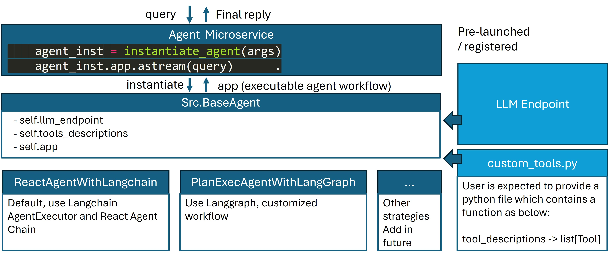

# langchain Agent Microservice

The langchain agent model refers to a framework that integrates the reasoning capabilities of large language models (LLMs) with the ability to take actionable steps, creating a more sophisticated system that can understand and process information, evaluate situations, take appropriate actions, communicate responses, and track ongoing situations.



# 🚀1. Start Microservice with Python（Option 1）

## 1.1 Install Requirements

```bash
cd comps/agent/langchain/
pip install -r requirements.txt
```

## 1.2 Start Microservice with Python Script

```bash
cd comps/agent/langchain/
python agent.py
```

# 🚀2. Start Microservice with Docker (Option 2)

## 2.1 Prepare env

```bash
export HF_TOKEN=<YOUR HUGGINGFACE HUB TOKEN>
export HUGGINGFACEHUB_API_TOKEN=${HP_TOKEN}
export local_model_dir=<YOUR LOCAL DISK TO STORE MODEL>
export custom_tool_dir=<YOUR CUSTOM TOOL> #./comps/agent/langchain/tools/
```

## Use mistral as llm endpoint

```bash
model=mistralai/Mistral-7B-Instruct-v0.3

#single card
docker run --rm -p 8080:80 -v ${local_model_dir}:/data --runtime=habana --name "tgi-gaudi-mistral" -e HF_TOKEN=$HF_TOKEN -e HABANA_VISIBLE_DEVICES=all -e OMPI_MCA_btl_vader_single_copy_mechanism=none --cap-add=sys_nice --ipc=host ghcr.io/huggingface/tgi-gaudi:2.0.0 --model-id $model --max-input-tokens 1024 --max-total-tokens 2048
```

## Use LLAMA-3-70B as llm endpoint


```bash
export model=meta-llama/Meta-Llama-3-70B-Instruct
export port_number=8008
export parallel_number=8

#multi cards
docker run -it --runtime=habana --rm --name="vllm-service" -v ${local_model_dir}:/root/.cache/huggingface/hub -p $port_number:80 -e HABANA_VISIBLE_DEVICES=all -e OMPI_MCA_btl_vader_single_copy_mechanism=none --cap-add=sys_nice --ipc=host -e HTTPS_PROXY=$https_proxy -e HTTP_PROXY=$https_proxy -e HF_TOKEN=${HUGGINGFACEHUB_API_TOKEN} vllm:hpu /bin/bash -c "export VLLM_CPU_KVCACHE_SPACE=40 && python3 -m vllm.entrypoints.openai.api_server --enforce-eager --model $model  --tensor-parallel-size $parallel_number --host 0.0.0.0 --port 80"
```

## 2.2 Build Docker Image

```bash
cd ../../../ # back to GenAIComps/ folder
docker build -t opea/comps-agent-langchain:latest --build-arg https_proxy=$https_proxy --build-arg http_proxy=$http_proxy -f comps/agent/langchain/docker/Dockerfile .
```

## 2.3 Run Docker with CLI

```bash
docker run -d --rm --runtime=runc --name="comps-langchain-agent-endpoint" -v ${custom_tool_dir}:/home/user/comps/agent/langchain/tools -p 9090:9090 --ipc=host -e http_proxy=$http_proxy -e https_proxy=$https_proxy -e HUGGINGFACEHUB_API_TOKEN=${HUGGINGFACEHUB_API_TOKEN} opea/comps-agent-langchain:latest
```

> debug mode
>
> ```bash
> docker run --rm --runtime=runc --name="comps-langchain-agent-endpoint" -v ./comps/agent/langchain/:/home/user/comps/agent/langchain/ -p 9090:9090 --ipc=host -e http_proxy=$http_proxy -e https_proxy=$https_proxy -e HUGGINGFACEHUB_API_TOKEN=${HUGGINGFACEHUB_API_TOKEN} opea/comps-agent-langchain:latest
> ```

# 🚀3. Get Status of Microservice

```bash
docker container logs -f comps-langchain-agent-endpoint
```

# 🚀4. Consume Microservice

Once microservice starts, user can use below script to invoke.

```bash
cd comps/agent/langchain/; python test.py --endpoint_test --ip_addr=${endpoint_ip_addr}

{"query": "What is the weather today in Austin?"}
data: 'The temperature in Austin today is 78°F.</s>'

data: [DONE]


```
