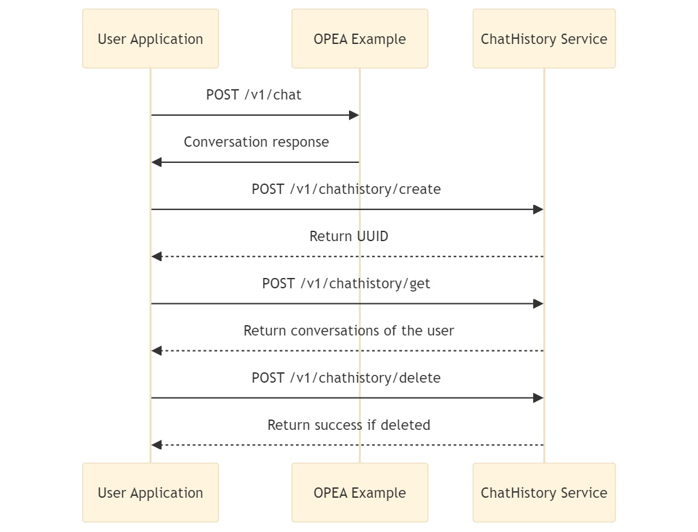

# 📝 Chat History Microservice

The Chat History Microservice is a scalable solution for storing, retrieving and managing chat conversations using various type of databases. This microservice is designed to seamlessly integrate with OPEA chat applications, enabling data persistence and efficient management of chat histories.

It can be integrated into application by making HTTP requests to the provided API endpoints as shown in the flow diagram below.

## 🛠️ Features

- **Store Chat Conversations**: Save chat messages user information, and metadata associated with each conversation.
- **Retrieve Chat Histories**: Fetch chat histories for a specific user or retrieve a particular conversation by its unique identifier.
- **Update Chat Conversations**: Modify existing chat conversations by adding new messages or updating existing ones.
- **Delete Chat Conversations**: Remove chat conversations record from database.

## ⚙️ Deployment Options

To get detailed, step-by-step instructions on deploying the `chathistory` microservice, you should consult the deployment guide. This guide will walk you through all the necessary steps, from building the Docker images to configuring your environment and running the service.

| Platform | Deployment Method | Database | Link                                                             |
| -------- | ----------------- | -------- | ---------------------------------------------------------------- |
| CPU      | Docker            | ArangoDB | [Deployment Guide](./deployment/docker_compose/README_arango.md) |
| CPU      | Docker            | MongoDB  | [Deployment Guide](./deployment/docker_compose/README.md)        |
| CPU      | Docker            | Redis    | [Deployment Guide](./deployment/docker_compose/README_redis.md)  |
| CPU      | Docker Compose    | ArangoDB | [Deployment Guide](./deployment/docker_compose/README_arango.md) |
| CPU      | Docker Compose    | MongoDB  | [Deployment Guide](./deployment/docker_compose/README.md)        |
| CPU      | Docker Compose    | Redis    | [Deployment Guide](./deployment/docker_compose/README_redis.md)  |
