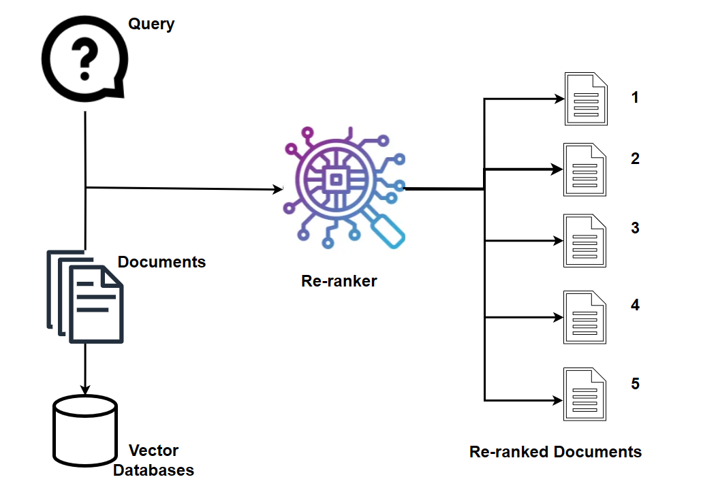

# Reranking Microservice

The Reranking Microservice, fueled by reranking models, stands as a straightforward yet immensely potent tool for semantic search.

---

The Reranking Microservice support two features: **text reranking** and **video result reranking** for VideoQnA use case.

## 🛠️ Features

- **rerank on retrieved documents**: Perform reranking on the given documents using reranking models together with query.

The Reranking Microservice, fueled by reranking models, stands as a straightforward yet immensely potent tool for semantic search.
When provided with a query and a collection of documents, reranking swiftly indexes the documents based on their semantic relevance to the query,
arranging them from most to least pertinent. This microservice significantly enhances overall accuracy. In a text retrieval system,
either a dense embedding model or a sparse lexical search index is often employed to retrieve relevant text documents based on the input.
However, a reranking model can further refine this process by rearranging potential candidates into a final, optimized order.

---

- **video result reranking**: Perform reranking on the given vidoe list, it sorts the video as a descending list of names, ranked by their degree of match with the query.

This microservice is designed that do result rerank for VideoQnA use case. Local rerank is used rather than rerank model.

For the `VideoQnA` usecase, during the data preparation phase, frames are extracted from videos and stored in a vector database.
To identify the most relevant video, we count the occurrences of each video source among the retrieved data with rerank function `get_top_doc`.
This sorts the video as a descending list of names, ranked by their degree of match with the query.
Then we could send the `top_n` videos to the downstream LVM.

---

## ⚙️ Implementation

### Utilizing Reranking with OVMS

For additional information, please refer to this [README](./README_ovms.md)

### Utilizing Reranking with TEI

For additional information, please refer to this [README](./README_tei.md)

### Utilizing Reranking with VideoQnA

For additional information, please refer to this [README](./README_videoqna.md)
